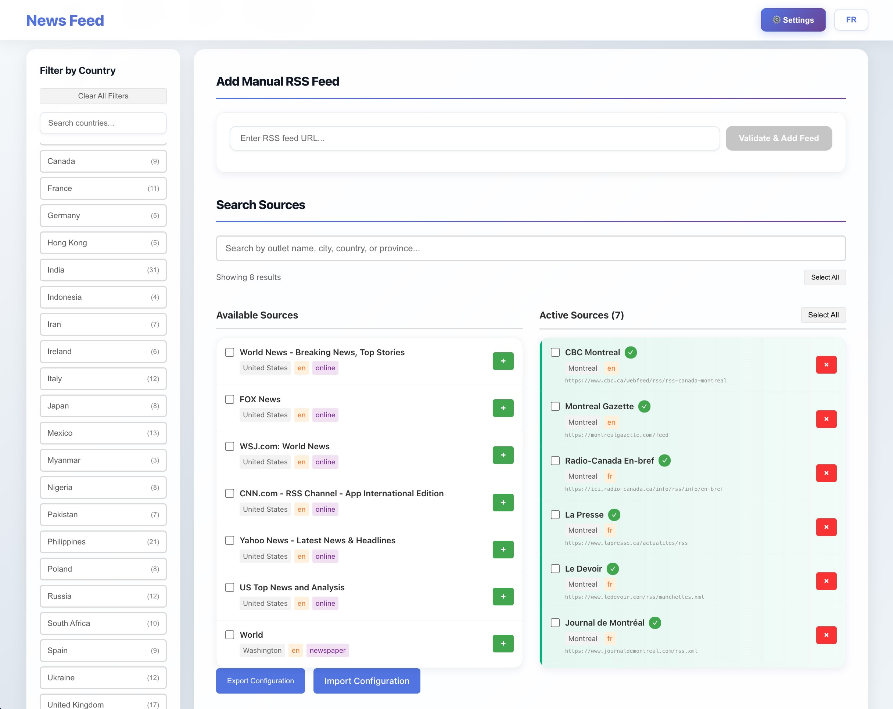

# News Feed Application

A modern, bilingual news aggregator that brings together the latest articles from multiple sources in one convenient place. The application automatically fetches news from RSS feeds, displays them in an easy-to-read format, and lets you organize your reading with customizable tabs.



## Features

- **Bilingual Interface**: Switch between French and English with a single click
- **Multiple News Sources**: Aggregates articles from various news outlets
- **Smart Organization**: Create custom tabs to organize news by topic, region, or interest
- **Real-time Updates**: Automatically refreshes news every 5 minutes (can be disabled)
- **Advanced Filtering**: Filter by language, category, date, or search keywords
- **Responsive Design**: Works beautifully on desktop and tablet devices
- **Local Caching**: Articles are cached locally for faster loading

## News Sources

The application comes pre-configured with the following sources:

**English Sources:**
- CBC Montreal
- Montreal Gazette

**French Sources:**
- Radio-Canada En-bref
- La Presse
- Le Devoir
- Journal de Montréal

You can easily add, remove, or modify sources through the Settings page.

## Installation (Docker)

The easiest way to run this application is using Docker. Make sure you have Docker and Docker Compose V2 installed on your system.

### Quick Start

1. **Clone or download this repository**

2. **Configure environment variables:**
   ```bash
   cp .env.example .env
   ```
   
   Edit the `.env` file and set the `HOST` variable:
   - For local development: `HOST=localhost` (default)
   - For production: Set `HOST` to your domain name (e.g., `HOST=news.example.com`)
   
   If you need to allow multiple hosts, use `ALLOWED_HOSTS` instead (comma-separated):
   ```
   ALLOWED_HOSTS=news.example.com,www.example.com
   ```

3. **Build and start the application:**
   ```bash
   ./build.sh
   ```
   
   Or manually:
   ```bash
   docker compose up -d --build
   ```

4. **Access the application:**
   Open your web browser and navigate to:
   ```
   http://localhost:3072
   ```
   (Or use your configured domain if you set HOST to a domain name)

That's it! The application is now running.

### Managing the Application

**View logs:**
```bash
docker compose logs -f newsfeed
```

**Stop the application:**
```bash
docker compose down
```

**Restart the application:**
```bash
docker compose restart
```

**Rebuild after making changes:**
```bash
docker compose up -d --build
```

## Using the Application

For detailed instructions on all features and options, see the [User Guide](USER_GUIDE.md).

## Troubleshooting

**Port already in use:**
If port 3072 is already in use, you can change it in `docker-compose.yml`:
```yaml
ports:
  - "YOUR_PORT:3072"
```

**Application won't start:**
- Check that Docker is running: `docker ps`
- View logs: `docker compose logs newsfeed`
- Try rebuilding: `docker compose down && docker compose up -d --build`

**Can't access the application:**
- Make sure the container is running: `docker compose ps`
- Check that port 3072 is not blocked by a firewall
- Try accessing via `http://127.0.0.1:3072`

## Technical Notes

- The application runs on port 3072 by default
- All data (tabs, sources, preferences) is stored in your browser's local storage
- RSS feeds are fetched through a backend proxy to handle CORS restrictions
- The application automatically handles character encoding for international content

## Support

For issues or questions, please check the application logs using:
```bash
docker compose logs -f newsfeed
```
